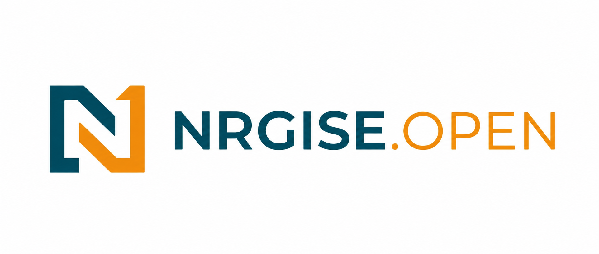

[![CC BY-NC-SA 4.0][cc-by-nc-sa-shield]][cc-by-nc-sa]
[](https://github.com/astral-sh/ruff)

*NRGISE Open* is a Python framework for simulating local energy systems over time.

It uses sequential time-step simulation to model the interaction between electrical components of the energy system and control strategies under realistic operating conditions. NRGISE provides ready-to-use components and controllers while remaining extensible, allowing researchers and engineers to implement custom models and controllers. Unlike optimization-focused frameworks, NRGISE is built around explicit controllers and rolling-horizon simulation, making it well suited for techno-economic assessments under realistic operating conditions.

## What you can do with *NRGISE Open*

- **Simulate common use cases out of the box:** Plug your PV and load data into our predefined examples to simulate use cases such as  self-consumption maximization and peak shaving without writing custom code.
- **Techno-economic assessments:** Evaluate how storage sizing, control strategies and system configurations affect technical and economic performance.
- **Develop and benchmark controllers:** Use NRGISE as a simulation environment for developing, testing, and benchmarking custom controllers, from simple rule-based strategies to model predictive control, reinforcement learning, and other advanced approaches.
- **Study impact of forecasting:** Integrate custom forecasting models into rolling-horizon simulations and investigate how forecast errors affect system operation and economic performance.
- **Run simulation studies at scale:** Execute parameter sweeps and batch simulations to compare hundreds or thousands of scenarios for sizing studies, sensitivity analyses, or scientific experiments.
- **Extend the framework:** Implement your own components, storage models, controllers, forecasters, aging models, or economic models using our well-defined interfaces.

## When another tool may be a better fit
- When you just want to see the mathematically optimal system layout without explicitly considering control strategies: Use an optimization-based tool like [oemof](https://oemof.org/), [ETHOS.FINE](https://vsa-fine.readthedocs.io/en/develop/) or [PyPSA](https://github.com/pypsa/pypsa)
- When you want to model sector coupling (electricity, heat and mobility): Use [oemof](https://oemof.org/) or [ETHOS.FINE](https://vsa-fine.readthedocs.io/en/develop/)
- When you need to model a large power grid: Use a spatially resolved tool like [PyPSA](https://github.com/pypsa/pypsa)
- When you want a deep dive into battery aging: Use [SimSES](https://gitlab.lrz.de/open-ees-ses/simses/)
- When you want to deploy your controller in real-time: Use a deployment tool like [OpenEMS](https://openems.io/) (however, NRGISE controllers can be coupled with it)

If none of these tools fit your list, see [OpenMod for a broader tool comparison](https://wiki.openmod-initiative.org/wiki/Overview_of_models)

## Installation


```
pip install nrgise
```
**Note that it is recommended to pin the version of the nrgise (e.g. `nrgise==0.X.Y`) to be safe from breaking changes of future versions**

Some of the controllers used in nrgise require a solver. You can install a solver e.g. by:
```
conda install conda-forge/label/cf202003::ipopt -y --override-channels -c conda-forge
```

## Documentation

Documentation can be found [here (will be added soon)](), and includes:
- User guides, including how to extend NRGISE for your use cases
- API documentation

## Example Usage

Basically, running a simulation with NRGISE is as easy as:

```python
from nrgise import EnergySystem, Simulation
from nrgise.components import AgingLinearCapacityWrapper, Battery, Grid, Load, Pv
from nrgise.controllers import SelfConsumptionController

# Create an energy system
es = EnergySystem(time_index=data.index)
grid = Grid(label='grid')
load = Load(label='load', power_profile=load_profile)
pv = Pv(label='pv', power_profile=generation_profile)
battery = Battery(
    label='battery',
    time_delta_seconds=es.time_delta_seconds,
    nom_power=200,
    capacity=800
)
# Wrap the storage with an aging wrapper if you want to consider aging
aging_battery = AgingLinearCapacityWrapper(storage=battery, lifetime_in_years=10, max_cycles=10000, eol=0.7)
es.add_components(grid, load, aging_battery, pv)

# Define a controller
controller = SelfConsumptionController(storage_label='battery')

# Run the simulation
simulation = Simulation(energy_system=es, controller=controller)
results = simulation.run()
```

## Yet, Before You Start: You Should Know

- All units concerning "electricity" are in **kW** or **kWh**
- All units concerning money are in €
- We follow the principle that: Power that "goes into" the local simulated energy 
   system has positive values. Power that is "taken from" it has negative values. Examples:
    - The load profile usually contains negative values
    - The solar generation profile contains usually positive values.
    - When charging a storage, we use negative values as (from the perspective of the energy system) the power "goes out".
    - Power flowing from a `GridBuilder` (e.g. a "normal" grid connection point `Grid`) into the energy system is positive, 
      power flowing in the other direction is negative.

To give you an introduction to NRGISE, we have provided you with some [examples](examples/).

## Contributing and Support

We welcome contributions from the community. If you have ideas for improvements, feature requests, or encounter a bug, feel free to open an issue or submit a pull request.

1. To discuss with other users, share insights, or to just get in touch with others within the community, you can use our [forum (will be added soon)](forum)
2. For bugs and feature requests please open an [issue (will be added soon)](issue)
   
Detailed guidelines for contributions can be found in [Contributing](docs/contributing.md).

## Team

Organisational: nils.reiners@ise.fraunhofer.de

Technical: tobias.rohrer@ise.fraunhofer.de; ricarda.hogl@ise.fraunhofer.de

## Cite As

We don't have a proper "nrgise centric" publication yet. Until then, cite as (BibTeX):

```
@article{nrgise,
    title = {Exploring the profitability of single and multi-use energy storage systems mirroring real-world conditions},
    journal = {Applied Energy},
    volume = {383},
    pages = {125353},
    year = {2025},
    issn = {0306-2619},
    doi = {https://doi.org/10.1016/j.apenergy.2025.125353},
    author = {Tobias Rohrer and Nils Reiners and Ricarda Hogl},
}
```

A list of publications using *NRGISE Open* can be found [here](link)

## License

[![CC BY-NC-SA 4.0][cc-by-nc-sa-image]][cc-by-nc-sa]

Our primary goal in making *NRGISE Open* available is to support academia, research, education, and other non-commercial use. For this reason, *NRGISE Open* is licensed under CC BY-NC-SA 4.0.

If you would like to use NRGISE Open for commercial purposes, we offer separate commercial licensing options. Please [get in touch with us][get-in-touch] to discuss the appropriate license for your use case.


[cc-by-nc-sa]: http://creativecommons.org/licenses/by-nc-sa/4.0/
[cc-by-nc-sa-image]: https://licensebuttons.net/l/by-nc-sa/4.0/88x31.png
[cc-by-nc-sa-shield]: https://img.shields.io/badge/License-CC%20BY--NC--SA%204.0-lightgrey.svg
[get-in-touch]: https://www.ise.fraunhofer.de/de/send-mail?l=de&m=1.8ac33a44fa0e053df70c3d4743b4ae13&k=4e696c73205265696e657273&r=2f64652f6765736368616566747366656c6465722f656c656b747269736368652d656e657267696573706569636865722f6261747465726965696e746567726174696f6e2d756e642d62657472696562736675656872756e672f696e7465677269657274652d706c616e756e672d756e642d737465756572756e672d766f6e2d737065696368657273797374656d656e2d6e72676973652d6f6e652e68746d6c
