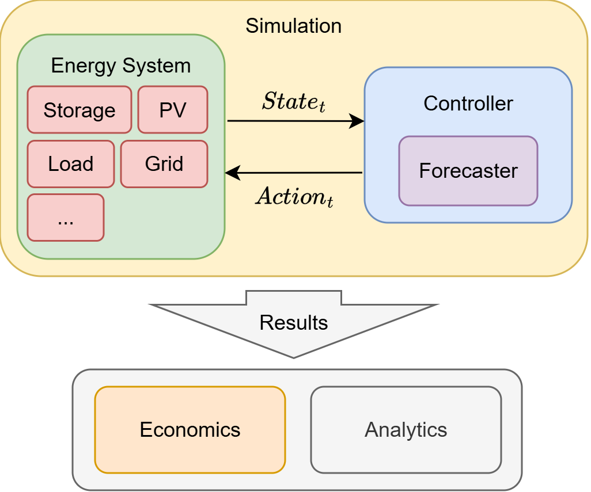

NRGISE is built around a simple but powerful principle: **the energy system model is strictly separated from the controller**. This separation allows the same energy system model to be evaluated with different control algorithms without modifying the underlying system model. Likewise, new system components can be integrated independently of the controller implementation. Additionally, it simplifies the transfer of control algorithms from simulation to real-world applications. Controllers interact solely through a standardized state-action interface, allowing them to be developed and validated in simulation before being connected to real systems exposing the same interface.

The energy system consists of a collection of components such as one or more storages, photovoltaic systems, electrical loads, a grid, or any user-defined component. Together, these components describe the system that is being simulated.

The controller is responsible for operating this system. At every simulation time step, the energy system exposes its current state, containing all information required for decision making. Based on this state, and optionally on forecasts of future quantities such as load or photovoltaic generation, the controller computes an action. This action is then executed by the energy system, which updates its components and advances the simulation to the next time step, resulting in a new state. This process is repeated sequentially until the end of the simulation horizon.

Conceptually, this interaction corresponds to a Markov Decision Process (MDP) in which the energy system acts as the environment and the controller as the agent. This abstraction makes NRGISE controller-agnostic and allows a wide range of control approaches to be implemented, including rule-based controllers, optimization-based methods such as Model Predictive Control (MPC), and Reinforcement Learning (RL).

Once the simulation has finished, NRGISE returns the recorded state and control trajectories as time series. These simulation results can be analysed directly or passed to additional modules such as the built-in Economics module to perform techno-economic evaluations, including energy costs, revenues, and investment analyses. The same simulation results can also serve as the basis for custom post-processing or visualization workflows. See [analyse results](./analyse-results.md) for more information.