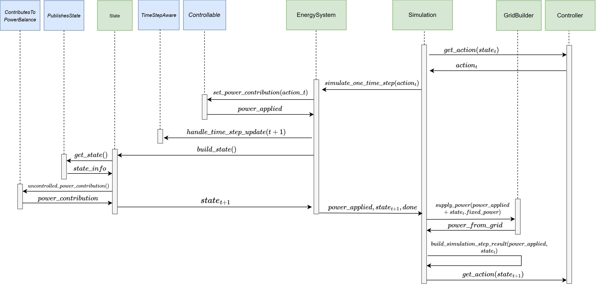

At a high level, the `Simulation` component iterates over time and coordinates the interaction between the Controller and the `EnergySystem` (and thus its containing components). The `EnergySystem` applies control actions, advances the simulation, and handles building of the resulting system state. The controller is responsible only for determining the controllable power contribution. Fixed production and consumption are represented separately through `ContributesToPowerBalanceMixin` and are combined with the controller's applied power after each simulation step to obtain the total system power balance.

Conceptually, each simulation step consists of three stages:

1. State Building: A new `State` of the EnergySystem and all its components is build. The `State` contains (1) arbitrary information of components published through `PublishesStateMixin`, (2) uncontrolled power contributions provided through `ContributesToPowerBalanceMixin` and (3) information about the current date time and time step.
2. Control: Based on the `State`, the controller computes an action. The action is dispatched by the `EnergySystem` to all `ControllableMixin` components. These return the power they were actually able to provide as a result (requested and provided power can differ, e.g. an empty battery cannot provide power).
3. Results: The simulation combines the uncontrolled power contributions from the `State` with the applied powers from the controllable components to determine the total system power balance. The `GridBuilder` supplies or absorbs any remaining imbalance, and the results of the time step are recorded.

The diagram below shows the detailed control flow of a single simulation step.

The blue boxes in the diagram represent the available mixins (see [Extending NRGISE](extending.md) for more details about mixins). The mixins indicate where a component participates in the simulation flow. For example, a component implementing `ControllableMixin` receives a control action, while a component implementing `ContributesToPowerBalanceMixin` or `PublishesStateMixin` is queried when the system state is built.

In more detail, the flow is as follows:

1. `Simulation` provides the current state `state_t` to `controller.get_action(state_t)`.
2. The controller returns `action_t` (plus optional additional info).
3. `Simulation` triggers the simulation of one time step in the `EnergySystem`.
4. Inside `EnergySystem`, the action is forwarded to all components implementing `ControllableMixin`. Each of these components returns the power that was actually applied (`power_applied`). This value may differ from the requested power, for example due to power limits or state-of-charge constraints.
5. The internal time step is advanced to `t+1`. As part of this step, all components implementing `TimeStepAwareMixin` are notified via `handle_time_step_update(...)`.
6. The next state `state_t+1` is built. During this step, all components implementing `PublishesStateMixin` and `ContributesToPowerBalanceMixin` are queried for their contribution to the `State`.
7. `simulate_one_time_step(...)` returns `power_applied`, `state_t+1`, and `done` back to `Simulation`.
8. Back in `Simulation`, grid balancing is performed via the `GridBuilder`.
9. The results of this simulation step are recorded. This includes the state, the requested power, the applied power, the power supplied by the `GridBuilder`, and any additional information returned by the controller.
10. The loop starts again.
